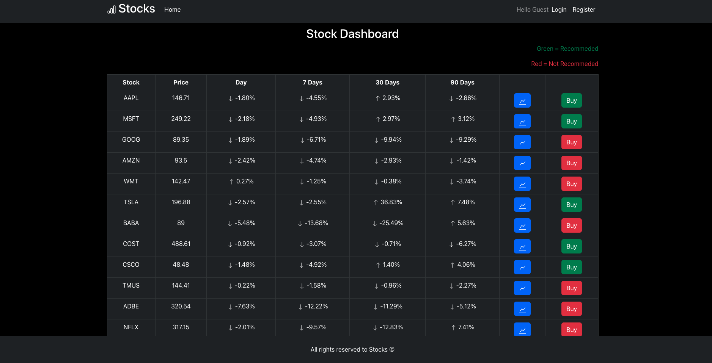

# Stock Dashboard Application

Stock Dashboard is a virtual platform that allows users to simulate trading stocks without risking real money.

## Features

- The application allows users to view and track stocks data.
- Users get recommendation according SMA indicator.
- Stock price update every 24 hours.
- Users can buy/sell stocks.
- Admin can add/remove stocks from the dashboard

### The system two type of users:

**Admin** - Can see all users stocks profiles and profit.

**User** - Can register, buy or sell stock, view is profile, transactions and profit.

### Technologies Used:

- Spring Framework
- Spring Security
- React
- TypeScript
- Redux
- MongoDB
- MySql
- Redis
